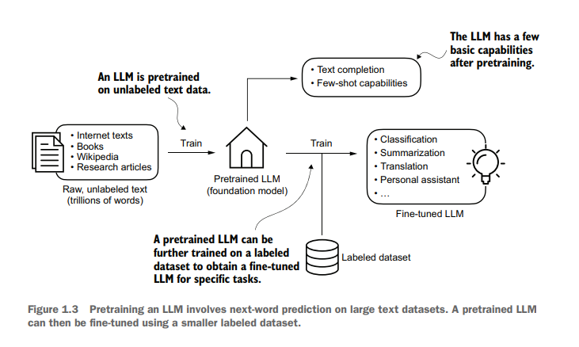

## THe process of Training LLM
The general process of creating an LLM includes pretraining and fine-tuning. The
“pre” in “pretraining” refers to the initial phase where a model like an LLM is trained
on a large, diverse dataset to develop a broad understanding of language. This pretrained model then serves as a foundational resource that can be further refined
through fine-tuning, a process where the model is specifically trained on a narrower
dataset that is more specific to particular tasks or domains. This two-stage training
approach consisting of pretraining and fine-tuning is depicted

The first step in creating an LLM is to train it on a large corpus of text data, sometimes
referred to as raw text. Here, “raw” refers to the fact that this data is just regular text
without any labeling information. (Filtering may be applied, such as removing formatting characters or documents in unknown languages.) . In this stage, LLMs use self-supervised learning, where the model generates its own labels from the input data.

The first training stage of an LLM is also called **pretraining** , creating an initial pre-trained LLM, often called a base or foundation model. Example is GPT-3. This model is capable of text completion, and has limited few-shot capabilities, which means it can learn to perfom new tasks based on only a few examples insted of needing extensive training data.

After obaining a pretrained model, we can further train the model on labeled data, also known as fine-tuning. Fine-tuning has two categories, instruction fine-tuning, and classification fine-tuning.

* In instruction finetuning, the labeled dataset consist of instruction and answer pairs, such as a query to translate a text accompanied by the correctly translated text. 
* In classification fine-tuning, the labeled dataset consists of texts and associated class labels.

## Introducing the transformer architecture
A transformer architecture is a deep neural network architecture introduced in the 2017 paper  [Attention is all you need](https://arxiv.org/abs/1706.03762)

The transformer architecture consists of two submodules: an encoder and a decoder.
* The encoder submodule, processes the input text and encodes it into a series of numerical representations or vectors that capture the contextual information of the input
* The decoder decoder module takes these encoded vectors and generates the output text.

Both the encoder and decoder consists of many layers connected by a so called self-attention mechanism. This mechanism allows the model to weigh the importance of different words or tokens in a sequence relative to each other. This mechanism enables the model to capture long-range dependencies and contectual relationships within the input data, enhancing it s ability to generate coherent and contextually relevant output.

* Zero-shot learning refers to the ability to generalize to completely unseen tasks without any prior specific examples.

* Few-shot learning involves learning from a minimal number of examples the user provides as input, as shown

LLMs are based on the transformer architecture. Not all transformers are LLMs since transformers can also be used for computer vision. Also, not all LLMs are transformers, as there are LLMs based on recurrent and convolutional architectures.